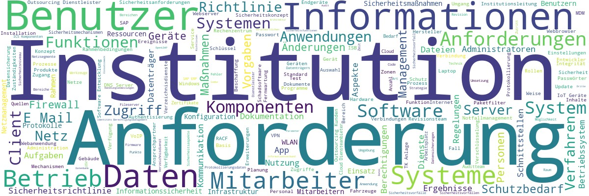

# IT-Grundschutz

## Aufbereitung IT-Grundschutz-Kompendium als JSON- und als XLSX-Datei(en)

Umwandlung des [IT-Grundschutz-Kompendiums](https://www.bsi.bund.de/DE/Themen/Unternehmen-und-Organisationen/Standards-und-Zertifizierung/IT-Grundschutz/IT-Grundschutz-Kompendium/it-grundschutz-kompendium_node.html) in eine [JSON](https://de.wikipedia.org/wiki/JavaScript_Object_Notation)-Datei

Ausgehend von der JSON-Datei:
Umwandlung jedes Bausteins des IT-Grundschutz-Kompendiums in eine Excel-Tabelle
- Eine Zeile je Teilanforderung (maximal genau ein Modalverb oder ein Einzelaspekt) jeder Anforderung
- In den Spalten Attribute der Teilanforderungen aus Perspektive Schicht, Baustein und Anforderung

In der Tabelle auch Delta-Informationen zur Vorjahresedition 
- Zu jeder Teilanforderung Angabe der Teilanforderung der Vorjahresedition mit der größten [Kosinus-Ähnlichkeit](https://de.wikipedia.org/wiki/Kosinus-%C3%84hnlichkeit) (innerhalb des gleichen Bausteins und innerhalb des gesamten IT-GS-Kompendiums)
- Zu jeder Teilanforderung Hinweise zu jedem geänderten Attribut bzgl. Schicht, Baustein oder Anforderung 

In der Tabelle auch Leerfelder für [GSC](https://www.bsi.bund.de/DE/Themen/Unternehmen-und-Organisationen/Standards-und-Zertifizierung/IT-Grundschutz/Zertifizierte-Informationssicherheit/IT-Grundschutzschulung/Online-Kurs-IT-Grundschutz/Lektion_6_IT-Grundschutz-Check/Lektion_6_node.html;jsessionid=6C7A24BA0A68383A2C55DB433D49B4A3.internet082)-Ergebnisse und optional beliebige weitere Leerfelder z.B. zum Monitoring der Befunde und ihrer Korrekturmaßnahmen
