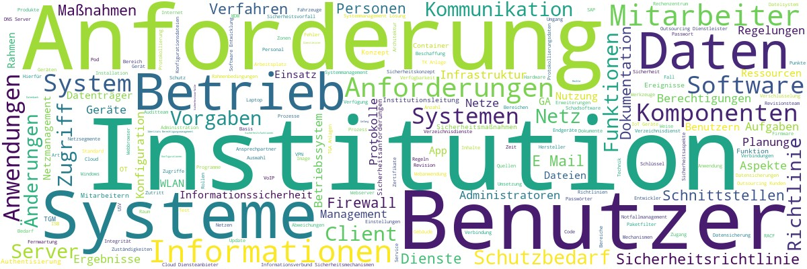

# IT-Grundschutz

## Aufbereitung IT-Grundschutz-Kompendium als JSON- und als XLSX-Datei(en)

Umwandlung des IT-Grundschutz-Kompendiums in eine JSON-Datei

Ausgehend von der JSON-Datei:
Umwandlung jedes Bausteins des IT-Grundschutz-Kompendiums in eine Excel-Tabelle
- Eine Zeile je Teilanforderung (genau ein Modalverb) jeder Anforderung
- In den Spalten Attribute der Teilanforderungen aus Perspektive Schicht, Baustein und Anforderung

In der Tabelle auch Delta-Informationen zur Vorjahresedition 
- Zu jeder Teilanforderung Angabe der Teilanforderung der Vorjahresedition mit der größten Kosinus-Ähnlichkeit (innerhalb des gleichen Bausteins und innerhalb des gesamten IT-GS-Kompendiums)
- Zu jeder Teilanforderung Hinweise zu jedem geänderten Attribut bzgl. Schicht, Baustein oder Anforderung 

In der Tabelle auch Leerfelder für GSC-Ergebnisse und optional beliebige weitere Leerfelder z.B. zum Monitoring der Befunde und ihrer Korrekturmaßnahmen
